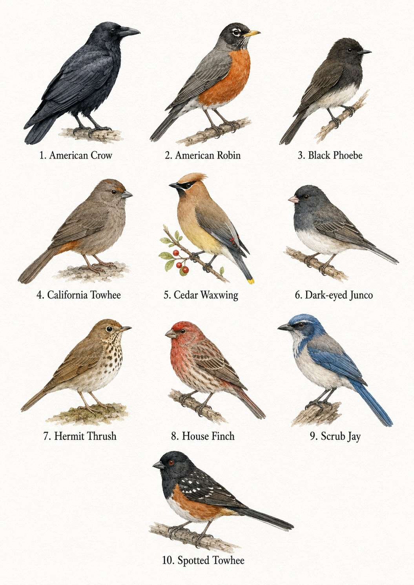

# Birdle 🐦

A fast-paced backyard bird-spotting game. Birds appear in the trees and play their calls - tap the matching button before they fly off. Build combos for big multipliers; misidentify and lose points (and your streak).

## How to play

1. **Start** the game from the title screen.
2. Choose a difficulty:
   - **Regular** – slower birds, fewer at once.
   - **Expert** – faster birds, crowded trees, bigger rewards.
3. When a bird appears, listen for its call and tap its name from the bottom panel.
4. Correct ID = points + combo multiplier. Wrong ID = points off + combo reset.
5. You have 60 seconds. Best score per difficulty is saved locally, and the global top 5 leaderboard.

## Birds you'll spot

American Crow · American Robin · Black Phoebe · California Towhee · Cedar Waxwing · Dark-eyed Junco · Hermit Thrush · House Finch · Scrub Jay · Spotted Towhee



## Run locally

It's a static site — no build step.

```bash
# any static server works, for example:
python3 -m http.server 8000
# then open http://localhost:8000
```

## Android APK (sideload to tablets)

`android/` is a minimal native wrapper that hosts the PWA in a fullscreen
landscape WebView, fully offline. Launcher icons are generated from the same
file the PWA manifest uses (`assets/pwa-icon-512.png`).

```bash
npm run apk:icons  # regenerate launcher icons from the PWA icon
npm run apk:build  # sync web assets + build the debug APK
```

The APK lands at `android/app/build/outputs/apk/debug/app-debug.apk`
(debug-signed, sideloadable). Install on a tablet with USB debugging enabled:

```bash
adb install -r android/app/build/outputs/apk/debug/app-debug.apk
```

Every push to `main` also builds the APK in CI (`.github/workflows/android.yml`)
and uploads it as the `birdle-debug-apk` artifact. Bump `versionCode` /
`versionName` in `android/app/build.gradle` for each release.
